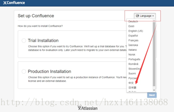

# 
centos下confluence的安装

[TOC]

## 环境
* centos7
* mysql5.7
* java

## 下载
1. [mysql驱动](https://pan.baidu.com/s/1OCqciR7OxUThaleZyRL9NA)
2. confluence安装包
   * [网盘下载]()
   * `wget https://downloads.atlassian.com/software/confluence/downloads/atlassian-confluence-6.7.1-x64.bin -P /opt`

## 安装
1. 将confluence安装包放在`/opt`目录下
2. 文件授权：`chmod +x atlassian-confluence-6.7.1-x64.bin`
3. 安装文件：`./atlassian-confluence-6.7.1-x64.bin`
   安装过程中可以根据自己情况选择安装模式，设置端口
   
4. 安装完成打开`http://localhost:8090`，记下填写授权码时的服务器ID
   
   
   
   
5. 安装目录：`/opt/atlassian/confluence`
6. 数据目录：`/var/atlassian/application-data/confluence`

## 破解
1. 停止confluence服务：`sh /opt/atlassian/confluence/bin/stop-confluence.sh`
2. 将`/opt/atlassian/confluence/confluence/WEB-INF/lib`下的`atlassian-extras-decoder-v2-3.3.0.jar`通过FTP传到本地，并重命名为`atlassian-extras-2.4.jar`
3. [下载注册机](https://pan.baidu.com/s/18puVreLymtLHVtsg0R0bLQ)
4. 解压下载的文件，解压其中的`confluence5.1-crack.zip`文件，并且dos进入`iNViSiBLE`目录
5. 执行`java -jar confluence_keygen.jar`
   
6. Name随便填写，Server ID是刚刚记下的服务器ID
7. 点击`.gen!`生成授权码
8. 点击`.patch`，选择`atlassian-extras-2.4.jar`文件，左下角提示success则是破解成功，生成的bak文件不用管
9. 将`atlassian-extras-2.4.jar`文件重命名为`atlassian-extras-decoder-v2-3.3.0.jar`并回传到`/opt/atlassian/confluence/confluence/WEB-INF/lib`
10. 启动confluence服务：`sh /opt/atlassian/confluence/bin/start-confluence.sh`
11. 此时进入`http://localhost:8090`，按步骤进行操作，将第七步生成的授权码填入输入框，即破解完成

## 数据库
此处选择的是mysql数据库
1. 将mysql驱动拷入`/opt/atlassian/confluence/confluence/WEB-INF/lib`
2. 重启confluence服务
3. 根据提示填入对应的数据库信息，下一步即可